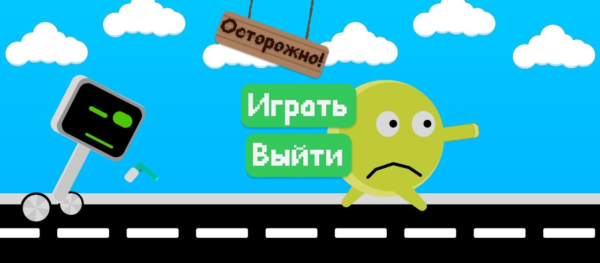

# ⚠️ Осторожно!

👤 **Авторы:** Артём Абрамов, Павел Живушко

🎮 Мобильная игра в духе *Dumb Ways to Die* — сборник коротких мини-игр (примерно 5–30 секунд каждая). Уровень состоит из случайно выбранных шести мини-игр под общий таймер ⏱️; нужно пройти все подряд, не проиграв ни в одной.

## 📱 Платформа

Игра реализована под **[Аврора ОС](https://www.auroraos.ru/)** 🇷🇺 — российскую операционную систему для смартфонов (на базе Sailfish OS). Для отдельных мини-игр используются возможности устройства: сенсорный экран, микрофон 🎤 и другие разрешения по необходимости.

## 🚀 Как запустить

### На смартфоне (Аврора ОС)

1. Скачайте **RPM-пакет** для своей архитектуры из [последнего релиза](https://github.com/top-it-090304/Yarche/releases/latest):
   - [aarch64](https://github.com/top-it-090304/Yarche/releases/download/demo-2026-05-18/ru.yarche.becareful-1.0.0-1.aarch64.rpm) (большинство современных устройств)
   - [armv7hl](https://github.com/top-it-090304/Yarche/releases/download/demo-2026-05-18/ru.yarche.becareful-1.0.0-1.armv7hl.rpm)
2. Установите пакет на устройстве (через файловый менеджер):
3. Запустите приложение **«Осторожно!»** из меню приложений.

### В редакторе (разработка и тест)

1. Установите **[Godot 4.4](https://godotengine.org/download/archive/4.4-stable/)** (версия должна совпадать с проектом).
2. Клонируйте репозиторий и откройте в Godot папку проекта (файл `project.godot` → **Import & Edit**).
3. Нажмите **F5** (или кнопку ▶ **Run Project**) — запустится главное меню.

## ✨ Особенности

- 🕹️ **Иммерсивное управление:** тапы, свайпы, микрофон (дуйте, чтобы потушить огонь 🔥).
- 📈 **Прогрессия сложности:** несколько мини-игр подряд с разным лимитом времени; чем дальше — тем жёстче условия.
- 🎨 **Разные сценарии:** у каждой мини-игры своя механика и визуальный стиль.

## 🎯 Мини-игры

| Мини-игра | Суть |
|-----------|------|
| 👆 **Tap Game** | Быстро нажимайте по экрану, чтобы убежать от преследователя. |
| 🔧 **Pump Game** | Качайте насос свайпами; доведите давление до нормы, не перекачав. |
| 🔥 **Fire Game** | Дуйте в микрофон, чтобы предмет не сгорел. |
| 🧽 **Clean Game** | Очистите объект за отведённое время. |
| 🥔 **Potato Game** | Чистите картофель свайпами. |
| 📄 **Papers Game** | Работа с бумагой (жесты по экрану). |
| 🧠 **Memory Game** | Запомните и повторите последовательность. |
| 🐟 **Avoid the Garbage** | Уводите рыбу от мусора, перетаскивая по экрану. |
| 🦫 **Hit the Beaver** | Быстро отреагируйте и нажмите в нужный момент. |
| 🔌 **Wires Game** | Соедините провода в правильном порядке. |
| 💣 **Water Mine Game** | Управляйте персонажем, избегая мин. |
| 🎯 **Sniper Find Game** | Найдите цель в сцене. |
| ✈️ **Flappy Plane** | Удерживайте самолёт в полёте, облетая препятствия. |

## 🛠️ Технологический стек

| Направление | Инструменты |
|-------------|-------------|
| 💻 Разработка | [Godot 4.4](https://godotengine.org/) + GDScript |
| 🖼️ Графика и анимация | Figma, Krita |
| 🎧 Звук и музыка | FL Studio + звуковые ассеты с лицензией **free for non-commercial use** (некоммерческое использование) |

## 📂 Структура проекта

- 📁 `scenes/levels/` — мини-игры и общий уровень (`base_level`)
- 📁 `scenes/menu/` — главное меню, выбор уровня, экраны победы и поражения 🏆 / 💀
- 📁 `assets/` — графика, звуки, шрифты, шейдеры
- 📁 `icons/` — иконки приложения для Аврора ОС
